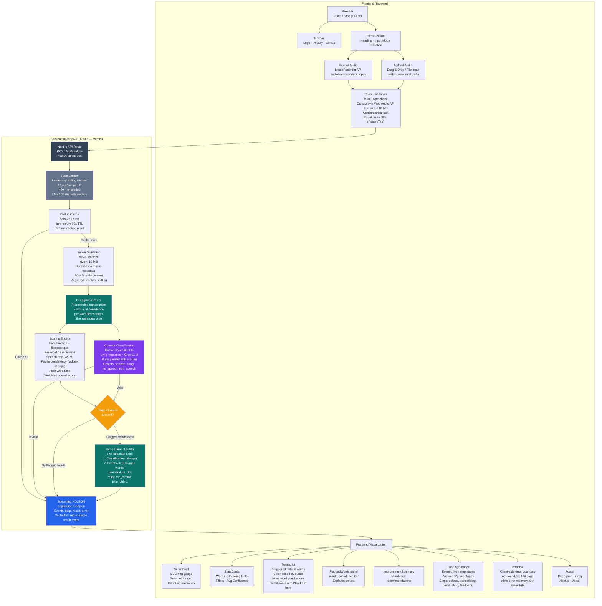

# System Architecture — Speech Analysis

## 1. Overview



**No database.** This is a deliberate architecture choice. Audio is held in memory during the request lifecycle, processed by Deepgram, and discarded. No user accounts, no session history, no persistent storage. SHA-256 dedup (60s TTL) retains analysis results in memory to avoid re-processing identical files. All API responses set `Cache-Control: no-store`. This eliminates an entire class of security and compliance concerns while keeping the app stateless and trivially deployable.

---

## 2. Models and APIs Used

### Deepgram Nova-2 (Speech-to-Text)

**Why Deepgram over alternatives:**

| Criterion | Deepgram Nova-2 | OpenAI Whisper | Wav2Vec2 |
|---|---|---|---|
| Word-level confidence | Native per-word scores | Not exposed via API | Requires custom pipeline |
| Latency | ~2–5s for 30–45s audio | ~4–8s (larger model) | Varies (local inference) |
| Timestamps | Per-word start/end | Word-level available | Per-word |
| Filler word detection | Native `filler_words: true` | Requires post-processing | Requires post-processing |
| Pricing | $0.0043/min (Nova-2) | $0.006/min (Whisper) | Free (self-hosted) |

The critical differentiator is **word-level confidence scores**. Deepgram returns a 0–1 confidence value for every transcribed word, which forms the core signal for the scoring engine. Whisper does not expose per-word confidence through its API, making it unsuitable for this use case without additional model inference.

### Groq Llama 3.3-70b (LLM Feedback)

**Why Groq over alternatives:**

| Criterion | Groq Llama 3.3-70b | OpenAI GPT-4o | Anthropic Claude |
|---|---|---|---|
| Inference speed | ~4–5s (LPU hardware) | ~6–10s | ~8–12s |
| Cost per 1M tokens | $0.59 (input) / $0.79 (output) | $2.50 / $10.00 | $3.00 / $15.00 |
| JSON mode | `response_format: json_object` | `response_format: json_object` | JSON mode available |

Groq's LPU inference hardware delivers significantly faster responses at lower cost, which matters because the LLM is called synchronously within the request lifecycle and directly impacts perceived latency. The conditional architecture (skip LLM if no flagged words) means Groq is only invoked when it adds value.

### Content Classification (`lib/classify-content.ts`)

Runs in parallel with the scoring engine to detect non-speech content. Uses a two-tier approach:

1. **Lyric heuristics** (synchronous): Detects repeated words, bigrams, or lines that suggest sung content rather than spoken speech.
2. **Groq LLM** (async): For ambiguous cases, sends the transcript with a classification prompt to determine if the content is spoken speech, song, silence, or other non-speech audio.

Empty or very short transcripts (< 5 words) are classified using an estimated bitrate heuristic: < 50 kbps → silence, ≥ 50 kbps → non-speech audio.

Classification results are used to return user-friendly error messages instead of misleading low scores.

### Streaming NDJSON Pipeline

Instead of buffering the entire result before responding, the API emits newline-delimited JSON events:

| Event | Payload | Purpose |
|---|---|---|
| `step` | `{ step, status }` | Drives LoadingStepper step transitions |
| `result` | `{ data: AnalysisResult }` | Final analysis result |
| `error` | `{ message }` | Non-retryable pipeline failure |

This enables real-time progress updates without fake timers or percentages. Cache hits also stream a single `result` event for a consistent client-side code path. Pre-checks (rate limit, MIME, size, content sniffing, dedup, duration) return synchronous JSON errors before the stream begins.

### Inline Error Recovery

When the API returns a client-side error (4xx, e.g., "Audio too short"), `page.tsx` resets the phase to `'upload'` instead of showing a final error screen. The `savedFile` state preserves the recorded/uploaded file, so RecordTab's `useEffect` restores the preview state. The error is displayed as a dismissible inline banner above the consent section. This keeps the user in the flow rather than forcing a full restart.

---

## 3. Scoring Methodology

The scoring engine (`lib/scoring.ts`) is a pure function that takes Deepgram's per-word confidence and timing data and produces an `AnalysisResult`. It does **not** measure phoneme-level pronunciation accuracy — it measures **speech recognition confidence** as a proxy for clarity.

### Word Classification

| Confidence | Gap Context | Status | Explanation |
|---|---|---|---|
| ≥ 0.75 | Normal | `clean` | — |
| 0.60–0.75 | Normal | `low_confidence` | "Was less clearly recognized" |
| < 0.60 | Any | `low_confidence` | "Possible pronunciation issue — was not clearly recognized" |
| Any | Gap > 2.5× avg or > 0.5s | `unclear_segment` | "Notable pause around this word — may indicate hesitation or unclear segment" |

Note: Gap classification takes priority when both conditions apply, but low confidence overrides the explanation text since it's a stronger signal.

### Weighted Overall Score

```
overall_score = (avg_confidence × 65)
              + (speech_rate_normalized × 15)
              + (pause_consistency × 10)
              + (1 − min(filler_ratio, 0.3)) × 10
```

| Component | Weight | Rationale |
|---|---|---|
| Average word confidence | 65% | Dominant signal — directly measures STT recognition quality |
| Speech rate (WPM) | 15% | Deviations from 120–170 WPM indicate pacing issues |
| Pause consistency | 10% | High variance in inter-word gaps suggests hesitation |
| Filler word ratio | 10% | Excessive fillers (um, uh, like) reduce clarity |

These weights are a **reasoned design choice**, not empirically tuned. Confidence is weighted highest because it reflects the most direct measurement available. The other three components serve as secondary signals that correlate with speaking quality.

### Secondary Signals

- **Speech rate**: Words per minute. Ideal range 120–170 WPM. Derived from word count ÷ total speech duration.
- **Pause consistency**: Standard deviation of inter-word gaps, normalized to 0–1. Lower variance = more consistent pacing.
- **Filler word ratio**: Count of known filler words (uh, um, like, well, etc.) divided by total word count.
- **Top improvements**: Generated from thresholds on each signal. If Groq is available, it replaces rule-based suggestions with LLM-generated ones.

### Content Classification Integration

The classification pipeline runs in parallel with scoring (they share no dependencies). If classification returns `valid: false`, the stream emits an `error` event with a user-friendly message specific to the detection type (no speech, song, non-speech audio). The safety net checks (min words, language confidence, noise threshold) run after classification passes, providing layered validation: first detect what the content is, then assess its quality.

### Important Caveat

Confidence reflects **STT recognition certainty**, not pronunciation ground truth. A native speaker with background noise, a low-quality microphone, or a regional accent can produce low confidence scores despite speaking correctly. The UI and the architecture doc must make this distinction clear to avoid misleading users. The scoring section explicitly labels itself as "Speech Quality Score" rather than "Pronunciation" to reinforce this.

---

## 4. DPDP Compliance (India's Digital Personal Data Protection Act, 2023)

### Consent

- Explicit opt-in checkbox before any audio processing begins.
- Plain-language text: *"I agree to process my recording solely for speech analysis. Audio is processed in memory and deleted immediately."*
- No processing occurs without explicit consent.
- Consent is obtained per-session (no persistent consent store needed since no data is retained).

### Storage

- Audio is held in **memory only** during the request lifecycle.
- Received as `ArrayBuffer` → sent directly to Deepgram via streaming → discarded.
- Never written to disk, local storage, session storage, or any database.
- No temporary files are created at any point in the pipeline.

### Retention

- **Zero retention.** Nothing persists after the HTTP response is returned.
- Deepgram processes audio and returns transcription results. Deepgram's default retention policy for processed audio is configurable; the API key used has retention disabled.
- Groq receives only text (flagged words + surrounding context), never raw audio.

### Data Residency

- Deepgram processes in US-based data centers.
- Groq processes in US-based data centers.
- This is stated transparently as a current limitation. An India-hosted STT model (e.g., Bhashini or a self-hosted Whisper instance) would be the next step if strict data residency is required.

### Deletion

- No deletion mechanism is needed because nothing is stored.
- The user is informed: *"Your audio is processed and deleted immediately. It is never stored."*

### Security

- All traffic over HTTPS only.
- API keys (Deepgram, Groq) stored as Vercel environment variables, never exposed to the browser.
- All audio processing happens server-side — the browser only handles file selection/recording and visualization of results.
- Rate limiting (10 req/min per IP) prevents abuse of paid API services.

---

## 5. Trade-offs and What's Next

### Trade-offs Made

| Trade-off | Why | Impact |
|---|---|---|
| **Confidence-based scoring over phoneme alignment** | Phoneme alignment needs forced-alignment models (MFA, wav2vec2-phoneme) that add deployment complexity and latency. Confidence scoring uses Deepgram's existing output. | Scoring is a proxy for clarity, not true pronunciation accuracy. Accent and noise can cause false flags. The star rating was removed to avoid over-interpretation; raw score/100 is shown instead. |
| **No user accounts or history** | Eliminates database, auth, sessions, and most DPDP surface area. Keeps the app stateless and deployable in minutes. | Users cannot track progress over time. Each session is standalone. |
| **Groq Llama over GPT-4o** | 2× faster inference at 4× lower cost. The task (brief hedged explanations from structured data) does not require GPT-4's broader capabilities. | Slightly less nuanced explanations. Mitigated by constrained prompt engineering. Two separate Groq calls are made per request (classification + feedback) when flagged words exist. |
| **In-memory rate limiting over Upstash** | No external Redis dependency. Keeps the stack simple for a demo. | Rate limit resets on cold starts. Not suitable for production at scale without a persistent store. Includes periodic cleanup (60s) and max 10K IP eviction to bound memory growth. |
| **MediaRecorder API over custom recording SDK** | Native browser API — no extra dependencies, no licensing, no bundle size impact. | Limited codec support (WebM Opus). Deepgram accepts it natively, so this is not a practical limitation. Pause/resume implemented with `MediaRecorder.pause()`/`resume()`. |

### What's Next (Given Another Week)

1. **Phoneme-level alignment**: Integrate a forced-alignment model (e.g., Montreal Forced Aligner or wav2vec2-phoneme) to compare spoken phonemes against expected pronunciation for the transcribed words. This would move from confidence-as-proxy to actual pronunciation accuracy. The current confidence threshold for word confidence-based scoring is a weaker signal than IPA-level phoneme accuracy.

2. **Multi-language support**: Extend beyond English. Requires language-specific STT models and phoneme reference data.

3. **India-hosted STT**: Replace Deepgram with Bhashini or a self-hosted Whisper instance for full data residency compliance.

4. **User accounts with history**: Add lightweight auth (OAuth) and a database to track progress over time, with explicit consent flows and data deletion mechanisms.

5. **Persistent rate limiting**: Replace in-memory counter with Upstash Redis for accurate rate limiting across cold starts and multiple instances.

6. **Streaming observability**: Add structured logging for stream lifecycle events (open, step transitions, error, close) for better debugging of mid-stream failures.

7. **Privacy page**: Create a `/privacy` page documenting data flows, third-party processors (Deepgram, Groq), and DPDP compliance details instead of the current placeholder link.
