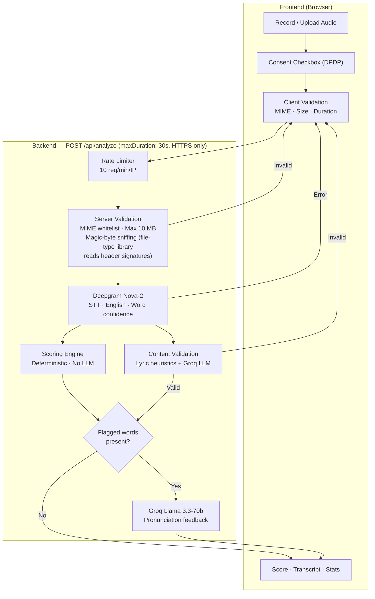

# System Architecture — Speech Analysis

## 1. Overview



**No database, no sessions, no user accounts.** Audio is held in memory during the request lifecycle and discarded. All responses set `Cache-Control: no-store`. API keys stored as Vercel environment variables, never exposed to the client.

## 2. Models and APIs

**Deepgram Nova-2** is used for speech-to-text because it provides native per-word confidence scores (0–1), per-word timestamps, and built-in filler word detection. Called with `language: 'en'`, `filler_words: true`, `smart_format: true`.

**Groq Llama 3.3-70b** is used for two purposes: (1) content validation — classifies the transcript as natural speech, song, rap, poem, movie dialogue, or gibberish (podcasts/audiobooks/TED Talks pass as `natural_speech`; scripted movie dialogue is rejected); (2) pronunciation feedback — generates hedged explanations for flagged words (only when flagged words exist, to avoid unnecessary latency). Feedback is intentionally hedged and avoids making unsupported phonetic claims.

**Content validation** runs in parallel with scoring: lyric heuristics (repeated words/phrases/lines) then Groq LLM for ambiguous cases. An empty-transcript fallback returns "no speech detected."

## 3. Scoring Methodology

The scoring engine is a **deterministic pure function** over Deepgram's word-level confidence and timing data. Pronunciation quality is estimated from these speech signals rather than phoneme-level acoustic alignment.

### Word Classification

| Confidence | Gap Context | Status | Explanation |
|---|---|---|---|
| ≥ 0.75 | Normal | `clean` | — |
| 0.60–0.75 | Normal | `low_confidence` | "Recognized with lower confidence. Slowing down may help." |
| < 0.60 | Any | `low_confidence` | "This word was recognized with lower confidence. Try speaking slightly slower and more clearly." |
| Any | Gap > 2.5× avg or > 0.5s | `unclear_segment` | "Notable pause around this word — may indicate hesitation or unclear segment" |

Pauses at sentence boundaries are excluded where possible. Gap classification takes priority when both conditions apply, but low confidence overrides the explanation text since it's a stronger signal.

### Speech Quality Score

```
overall_score = (avg_confidence × 65)
              + (speech_rate_normalized × 15)
              + (pause_consistency × 10)
              + (1 − min(filler_ratio, 0.3)) × 10
```

Confidence (65%) is weighted highest because it reflects the most direct measurement. Speech rate (15%) deviates from 120–170 WPM (conversational English). Pause consistency (10%) measures variance in inter-word gaps. Filler ratio (10%) penalizes excessive um/uh/like.

**Important caveat:** Confidence reflects STT recognition certainty, not pronunciation ground truth. Background noise, microphone quality, or regional accent can produce low scores despite correct speech. The score is labeled **"Speech Clarity Score"** rather than "Pronunciation" to avoid over-interpretation.

## 4. DPDP Compliance (India's Digital Personal Data Protection Act, 2023)

| Principle | Implementation |
|---|---|
| **Consent** | Explicit opt-in checkbox before any processing. Plain language: *"I agree to process my recording solely for speech analysis. Audio is processed in memory and deleted immediately."* |
| **Storage** | Audio held in memory during the request lifecycle. Received as `ArrayBuffer` → sent to Deepgram → discarded. Never written to disk, local storage, or any database. |
| **Retention** | The application itself retains no user data after processing. Third-party processors (Deepgram, Groq) handle requests transiently according to their configured retention policies. |
| **Data Residency** | Deepgram and Groq process in US-based data centers. An India-hosted STT model (Bhashini or self-hosted Whisper) would be the next step for strict residency. |
| **Deletion** | Nothing persists — there is nothing to delete. Each request is stateless; audio and transcript data exist only in memory during the request and are discarded on response. |
| **Security** | All traffic over HTTPS. API keys are server-side environment variables, never exposed to the browser. Rate limiting (10 req/min/IP) prevents abuse of paid services. |

## 5. Trade-offs and What's Next

| Trade-off | Rationale | Impact |
|---|---|---|
| **Confidence scoring over phoneme alignment** | Phoneme alignment needs forced-alignment models (MFA, wav2vec2-phoneme) adding complexity and latency. Confidence uses Deepgram's existing output. | Scoring is a proxy for clarity, not true pronunciation accuracy. |
| **No user accounts** | Eliminates database, auth, sessions, and DPDP surface area. | Users cannot track progress over time. |
| **Groq Llama over GPT-4o** | 2× faster inference at 4× lower cost for the task. | Slightly less nuanced explanations. |
| **In-memory rate limiting** | No external Redis dependency. | Resets on cold start; not production-scale. |

**Given another week:** Integrate phoneme-level alignment (Montreal Forced Aligner or wav2vec2-phoneme) to compare spoken phonemes against expected pronunciation, moving from confidence-as-proxy to actual pronunciation accuracy.
