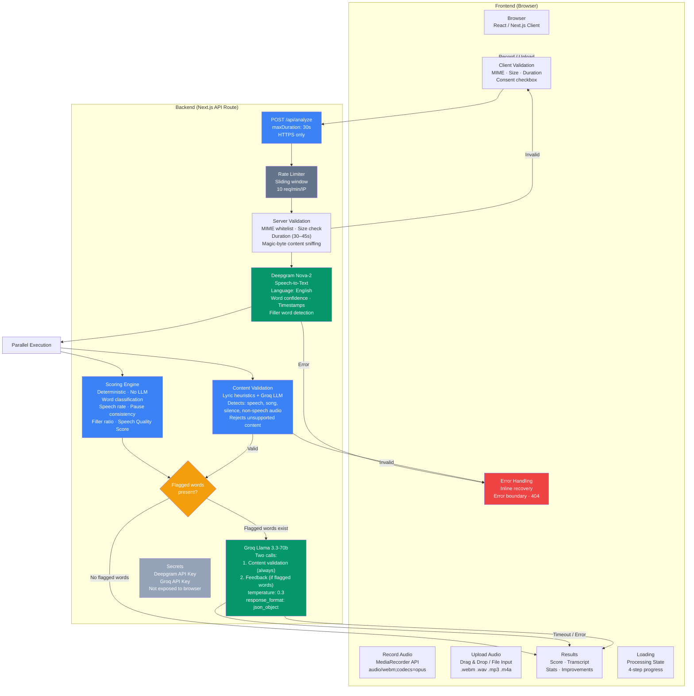

# System Architecture — Speech Analysis

## 1. Overview



**No database.** Audio is held in memory during the request lifecycle, processed by Deepgram, and discarded. No user accounts, no session history, no persistent storage. All API responses set `Cache-Control: no-store`. This eliminates an entire class of security and compliance concerns while keeping the app stateless and trivially deployable.

All communication between the browser and API runs over **HTTPS**. API keys for Deepgram and Groq are stored as Vercel environment variables and never exposed to the client.

---

## 2. Models and APIs Used

### Deepgram Nova-2 (Speech-to-Text)

**Why Deepgram over alternatives:**

| Criterion | Deepgram Nova-2 | OpenAI Whisper | Wav2Vec2 |
|---|---|---|---|
| Word-level confidence | Native per-word scores | Not exposed via API | Requires custom pipeline |
| Latency | ~2–5s for 30–45s audio | ~4–8s (larger model) | Varies (local inference) |
| Timestamps | Per-word start/end | Word-level available | Per-word |
| Filler word detection | Native `filler_words: true` | Requires post-processing | Requires post-processing |
| Pricing | $0.0043/min (Nova-2) | $0.006/min (Whisper) | Free (self-hosted) |

The critical differentiator is **word-level confidence scores**. Deepgram returns a 0–1 confidence value for every transcribed word, which forms the core signal for the scoring engine. The API is called with `language: 'en'` for consistent English recognition.

### Groq Llama 3.3-70b (LLM)

**Why Groq over alternatives:**

| Criterion | Groq Llama 3.3-70b | OpenAI GPT-4o | Anthropic Claude |
|---|---|---|---|
| Inference speed | ~4–5s (LPU hardware) | ~6–10s | ~8–12s |
| Cost per 1M tokens | $0.59 (input) / $0.79 (output) | $2.50 / $10.00 | $3.00 / $15.00 |
| JSON mode | `response_format: json_object` | `response_format: json_object` | JSON mode available |

Groq is used for two independent purposes:
1. **Content validation** — classifies the transcript as speech, song, silence, or non-speech audio
2. **Pronunciation feedback** — generates hedged explanations for flagged words (only when flagged words exist)

The conditional architecture (skip feedback if no flagged words) means Groq is only invoked when it adds value.

### Content Validation (`lib/classify-content.ts`)

Runs in parallel with the scoring engine to detect and reject unsupported content:

1. **Lyric heuristics** (synchronous): Detects repeated words, bigrams, or lines that suggest sung content.
2. **Groq LLM** (async): For ambiguous cases, classifies the transcript as speech, song, silence, or other non-speech audio.
3. **Bitrate heuristic**: For empty transcripts, estimates bitrate from file size and duration. Under 20 kbps → silence, under 80 kbps → uncertain (classified as non-speech), above → non-speech audio.

### Inline Error Recovery

When the API returns a client-side error (e.g., "Audio too short"), the UI resets to the upload screen instead of a dead-end error page. The `savedFile` state preserves the file, and the error appears as a dismissible inline banner. Users can retry immediately without restarting.

---

## 3. Scoring Methodology

The scoring engine (`lib/scoring.ts`) is a **deterministic pure function** with no LLM dependency. It takes Deepgram's per-word confidence and timing data and produces an `AnalysisResult`. It does **not** measure phoneme-level pronunciation accuracy — it measures **speech recognition confidence** as a proxy for clarity.

### Honest Scoring Disclaimer

Due to the scope and time constraints of the assessment, pronunciation quality is estimated using multiple speech signals (transcription confidence, fluency, speaking rate, and pauses) rather than phoneme-level acoustic alignment. This provides practical feedback while keeping the system lightweight and responsive.

### Word Classification

| Confidence | Gap Context | Status | Explanation |
|---|---|---|---|
| ≥ 0.75 | Normal | `clean` | — |
| 0.60–0.75 | Normal | `low_confidence` | "Recognized with lower confidence. Slowing down may help." |
| < 0.60 | Any | `low_confidence` | "This word was recognized with lower confidence. Try speaking slightly slower and more clearly." |
| Any | Gap > 2.5× avg or > 0.5s | `unclear_segment` | "Notable pause around this word — may indicate hesitation or unclear segment" |

Note: Gap classification takes priority when both conditions apply, but low confidence overrides the explanation text since it's a stronger signal.

### Speech Quality Score

```
overall_score = (avg_confidence × 65)
              + (speech_rate_normalized × 15)
              + (pause_consistency × 10)
              + (1 − min(filler_ratio, 0.3)) × 10
```

| Component | Weight | Rationale |
|---|---|---|
| Average word confidence | 65% | Dominant signal — directly measures STT recognition quality |
| Speech rate (WPM) | 15% | Deviations from 120–170 WPM indicate pacing issues |
| Pause consistency | 10% | High variance in inter-word gaps suggests hesitation |
| Filler word ratio | 10% | Excessive fillers (um, uh, like) reduce clarity |

These weights are a **reasoned design choice**, not empirically tuned. Confidence is weighted highest because it reflects the most direct measurement available. The other three components serve as secondary signals that correlate with speaking quality.

### Important Caveat

Confidence reflects **STT recognition certainty**, not pronunciation ground truth. A native speaker with background noise, a low-quality microphone, or a regional accent can produce low confidence scores despite speaking correctly. The UI and the architecture doc make this distinction clear: the score is labeled **"Speech Clarity Score"** rather than "Pronunciation" to avoid over-interpretation.

---

## 4. DPDP Compliance (India's Digital Personal Data Protection Act, 2023)

### Consent

- Explicit opt-in checkbox before any audio processing begins.
- Plain-language text: *"I agree to process my recording solely for speech analysis. Audio is processed in memory and deleted immediately."*
- No processing occurs without explicit consent.

### Storage

- Audio is held in **memory only** during the request lifecycle.
- Received as `ArrayBuffer` → sent directly to Deepgram → discarded.
- Never written to disk, local storage, session storage, or any database.

### Retention

- **Zero retention.** Nothing persists after the HTTP response is returned.
- Deepgram's default retention policy for processed audio is disabled.
- Groq receives only text (flagged words + surrounding context), never raw audio.

### Data Residency

- Deepgram processes in US-based data centers.
- Groq processes in US-based data centers.
- Stated transparently as a current limitation. An India-hosted STT model (Bhashini or self-hosted Whisper) would be the next step for strict data residency.

### Security

- All traffic over **HTTPS** only.
- API keys stored as Vercel environment variables, never exposed to the browser.
- All audio processing happens server-side.
- Rate limiting (10 req/min per IP) prevents abuse of paid API services.

---

## 5. Trade-offs and What's Next

### Trade-offs Made

| Trade-off | Why | Impact |
|---|---|---|
| **Confidence-based scoring over phoneme alignment** | Phoneme alignment needs forced-alignment models (MFA, wav2vec2-phoneme) that add deployment complexity and latency. Confidence scoring uses Deepgram's existing output. | Scoring is a proxy for clarity, not true pronunciation accuracy. Accent and noise can cause false flags. |
| **No user accounts or history** | Eliminates database, auth, sessions, and most DPDP surface area. Stateless and deployable in minutes. | Users cannot track progress over time. Each session is standalone. |
| **Groq Llama over GPT-4o** | 2× faster inference at 4× lower cost. The task does not require GPT-4's broader capabilities. | Slightly less nuanced explanations. Mitigated by constrained prompt engineering. |
| **In-memory rate limiting over Upstash** | No external Redis dependency. Keeps the stack simple. | Rate limit resets on cold starts. Not suitable for production at scale. |
| **MediaRecorder API over custom recording SDK** | Native browser API — no extra dependencies, no licensing. | Limited codec support (WebM Opus). Deepgram accepts it natively. |

### What's Next (Given Another Week)

1. **Phoneme-level alignment**: Integrate a forced-alignment model (Montreal Forced Aligner or wav2vec2-phoneme) to compare spoken phonemes against expected pronunciation. This would move from confidence-as-proxy to actual pronunciation accuracy.

2. **Multi-language support**: Extend beyond English. Requires language-specific STT models and phoneme reference data.

3. **India-hosted STT**: Replace Deepgram with Bhashini or a self-hosted Whisper instance for full data residency compliance.

4. **User accounts with history**: Add lightweight auth (OAuth) and a database to track progress over time, with explicit consent flows and data deletion mechanisms.

5. **Persistent rate limiting**: Replace in-memory counter with Upstash Redis for accurate rate limiting across cold starts and multiple instances.

6. **Streaming observability**: Add structured logging for pipeline lifecycle events for better debugging of failures.

7. **Privacy page**: Create a `/privacy` page documenting data flows, third-party processors, and DPDP compliance details.
